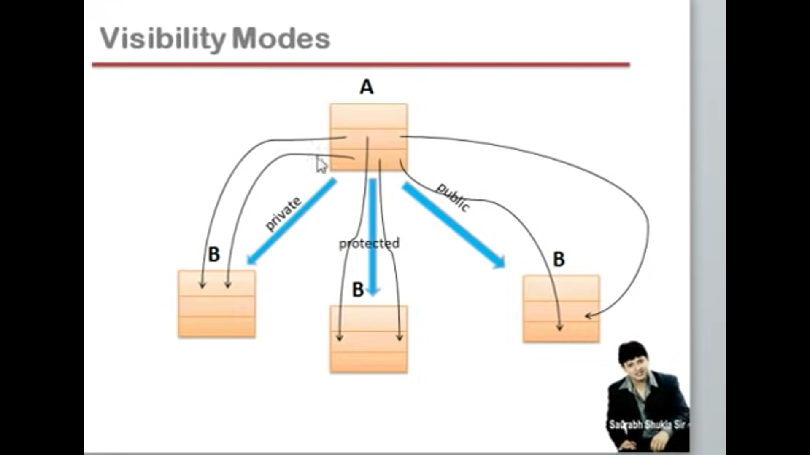

# Understanding the Need of Inheritance

In object-oriented programming, a class is utilized to describe the properties and behaviors (methods or functions) of an object. Each property is assigned a name, and different instances of classes (objects) contain distinct values for these properties. The properties are modified using the methods of the class.

To illustrate the need for inheritance, consider the representation of a basic car entity:

- **Properties:** 'Price,' 'Engine Type,' 'Colour,' 'Capacity'
- **Methods:** 'setPrice(),' 'setEngineType(),' 'setColour(),' 'setCapacity(),' 'getPrice(),' 'getEngineType(),' 'getColour(),' 'getCapacity()'

This representation encapsulates the characteristics and behaviors of a simple car. Now, let's extend this to represent more advanced car models, such as branded cars like Mercedes, Tesla, or Range Rover, which may have additional features like airbags, a fridge, a sunroof, a navigation system, and a TV.

## Options to Extend the Representation:

1. **Modify the Existing Class:**
   - Add all the properties and methods of the branded car along with those of the simple car in the existing class. However, this would lead to the end of the existence of the simple car.

2. **Create a Separate Class:**
   - Create a separate class exclusively for the branded car, containing only its specific properties and methods. However, this approach results in a problem because, to represent a branded car, we would need to create two separate objects—one for the simple car and one for the branded car. This violates the encapsulation principle as related properties and methods of an entity should be encapsulated within a single unit.

3. **Inheritance:**
   - The most suitable option is to establish a relationship between the simple car and the branded car. We can create a separate class for the branded car, adding only its specific features and methods. The branded car class is then linked (or inherits from) the simple car class. This relationship is unidirectional, meaning the child (branded car) can access the properties and methods of its parent (simple car), but not the other way around.

By using inheritance, we can achieve a structured representation of entities, maintain the integrity of the simple car, and extend it to represent more complex entities without compromising the principles of object-oriented programming.

In summary, inheritance provides a way to build upon existing classes, promoting code reuse, encapsulation, and a hierarchical organization of entities.

# Need for Inheritance in C++ Object-Oriented Programming

Inheritance is a fundamental concept in object-oriented programming (OOP) that allows a class to inherit properties and behaviors from another class. In C++, inheritance is a key feature that provides several benefits, contributing to code organization, reuse, and extensibility. Here are some reasons for the need of inheritance in object-oriented programming in C++:

## Code Reusability

Inheritance allows a new class (derived class or subclass) to reuse the properties and behaviors of an existing class (base class or superclass). This promotes code reusability and helps avoid redundancy.

## Extensibility

Derived classes can extend or modify the behavior of the base class. This allows for incremental development, where new functionality can be added to the program without modifying existing, working code.

## Hierarchy and Classification

Inheritance supports the creation of class hierarchies, allowing developers to model real-world relationships and classifications. For example, a base class "Vehicle" can have derived classes like "Car," "Truck," and "Motorcycle."

## Polymorphism

Inheritance is closely tied to polymorphism, another key OOP concept. Polymorphism enables objects of the derived classes to be treated as objects of the base class. This facilitates flexibility and generic programming.

## Method Overriding

Derived classes can provide their own implementation for the methods inherited from the base class. This is known as method overriding, and it allows customization of behavior in the context of the derived class.

## Code Organization

Inheritance supports a structured and organized approach to code design. By grouping related classes into hierarchies, the code becomes more modular and easier to understand, maintain, and extend.

## Abstraction

Inheritance contributes to abstraction by allowing the creation of abstract base classes that define the common interface and properties shared by multiple derived classes. Instances of these abstract classes can be used in a more general sense.

## Base Class as Interface

In C++, a base class can serve as an interface that defines a contract for derived classes. This contract specifies a set of methods that must be implemented by all derived classes, ensuring a consistent interface.

# Synatx for Inheritance
```cpp 
class BaseClass {
public:
    // Base class members
};

class DerivedClass : Visibility_Mode BaseClass {
public:
    // Derived class members
};

```

# Visbibility Mode and Concept of Availability and Accessibility in Inheritance

- C++ provides access specifiers such as `public`, `private`, and `protected` to control the visibility of class members.
     - `public`: Members are accessible from outside the class.
     - `private`: Members are only accessible within the class.
     - `protected`: Similar to private but allows access to derived classes.

- Types of Users of a Class
     - `user1` will create objects of your class.
     - `user2` will create derived class of your class.

-  Availabilty and Accessibility

     - When we create an object of a class, it occupies space in memory. While we can't directly access private or protected members from that object, it's important to 
       note that these members still consume memory. In other words, when objects of a class are instantiated, the members are available in memory, even though they are 
       not accessible from outside the class.
  
     - It's clear that when creating a derived class, we must specify the visibility mode from which we are deriving from the base class, whether it is `public`, 
       `protected`, or `private`. If no such mention is made, the default visibility mode is set to `private`.

  ## Visibility Modes in Derived Class

Let's explore the impact on data members and methods of the base class when deriving a class with respect to different visibility modes:

- **`private`**: This sets the protected and public members of the base class to `private` in the derived class.

- **`protected`**: It sets the protected and public members of the base class to `protected` in the derived class.

- **`public`**: No changes occur; `protected` remains `protected` in the derived class, and `public` remains `public` in the derived class.

We haven't discussed the fate of `private` members of the base class because no one has the authority to alter their visibility; they will always remain `private` everywhere.

- For understanding its thoroughly one must try different sets of permutations and combination of these diffrent visibilty modes through codes.



# RelationShip between  Classes(Entitites)

## Entities and Classes

In C++, entities are represented using classes. A class is a blueprint for creating objects, encapsulating data, and defining behavior.

## Association

Association represents the relationship between entities. There are various ways to establish associations between classes:

### 1. Aggregation

Aggregation represents a "has-a" relationship where one class contains another class as a part. It implies a weaker relationship, and the objects can exist independently.

Example:

```cpp
class Department {
    // ...
};

class University {
    std::vector<Department> departments;
    // ...
};
```
### 2. Composition

Composition is a stronger form of aggregation, where one class contains another class, and the contained class has a significant relationship with the container. If the container is destroyed, the contained class is also destroyed.

Example:

```cpp
class Engine {
    // ...
};

class Car {
    Engine carEngine;
    // ...
};
```
### 3. Inheritance

- Inheritance establishes an "is-a" relationship between classes. It allows a class to inherit properties and behaviors from another class, forming a hierarchy.e.g., Banana is a Fruit . Generalized class(Fruit) is Base Class and Specific Class(Banana) is Derived Class.
- The "is-a" relationship implies that an object of the derived class is also an object of the base class.
- "Is-a" relationship is always implemented as a public inheritance.(Explained in Code).

Example:

```cpp
class Animal {
public:
    void eat() {
        // ...
    }
};

class Dog : public Animal {
public:
    void bark() {
        // ...
    }
```
# Types of Inheritance in C++

In C++, inheritance allows a class to inherit properties and behaviors from another class. There are several types of inheritance:

## 1. Single Inheritance

In single inheritance, a derived class is derived from only one base class.

Example:

```cpp
class Base {
    // ...
};

class Derived : public Base {
    // ...
};
```
## 2. Multiple Inheritance

In multiple inheritance, a derived class is derived from more than one base class.

Example:

```cpp
class Base1 {
    // ...
};

class Base2 {
    // ...
};

class Derived : public Base1, public Base2 {
    // ...
};
```
## 3. Multilevel Inheritance

In multilevel inheritance, a class is derived from another derived class.
A tranistive relationship exist b/w base class and derived class.

Example:

```cpp
class Base {
    // ...
};

class Intermediate : public Base {
    // ...
};

class Derived : public Intermediate {
    // ...
};
```

## 4. Hierarchical Inheritance

In hierarchical inheritance, multiple classes are derived from a single base class.
In maximum scenarion, it will be possible.Its the most common inheritance you will see
in your code as well as real life.

Example:

```cpp
class Base {
    // ...
};

class Derived1 : public Base {
    // ...
};

class Derived2 : public Base {
    // ...
};
```
## 5. Hybrid Inheritance

Hybrid inheritance is a combination of two or more types of inheritance.

Example:

```cpp
class Base {
    // ...
};

class Derived1 : public Base {
    // ...
};

class Derived2 : public Base {
    // ...
};

class FinalDerived : public Derived1, public Derived2 {
    // ...

};
```

# Constructor in Inheritance

In C++, a constructor is a special member function that is invoked implicitly when an object is created. In the context of inheritance, when we create objects of a derived class, the following events take place:

1. **Memory Allocation:**
   - When an object of the derived class is created, memory is allocated for all the members of both the derived class and its base class(es).

2. **Base Class Constructor Invocation:**
   - The constructor of the base class is invoked first, initializing the base class members. This ensures that the base class part of the derived class object is properly initialized.

3. **Derived Class Constructor Invocation:**
   - After the base class constructor completes its execution, the constructor of the derived class is invoked. This initializes the derived class members.
   - Actually ,it is derived class constructor which calls the base class constructor.
   - Syntax for it : Derived() : Base() whether the coder write ohterwise it will be written implicitly by compiler.
   - We can say that calling order of Constructor is from Derived class to Base class whereas Execution is from Parent Class to Child Class.

## Example:

Consider the following example:

```cpp
#include <bits/stdc++.h>
using namespace std;
// Base class
class Base {
public:
    Base() {
        cout << "Base class constructor." << endl;
    }
};

// Derived class
class Derived : public Base {
public:
    Derived() {
        cout << "Derived class constructor." << endl;
    }
};

int main() {
    // Creating an object of the derived class
    Derived derivedObj;

    return 0;
}
```

## Implications of Parametrized Constructor in Base Class

In C++, when a base class has a parameterized constructor, and you derive a class from it, you must explicitly call the parameterized constructor of the base class from the derived class. This is because the compiler doesn't automatically generate a default constructor when a parameterized constructor is defined in the base class.

### Example:

Consider the following example:

```cpp
#include <bits/stdc++.h>
using namespace std;
// Base class with a parameterized constructor
class Base {
public:
    Base(int value) {
        cout << "Base class parameterized constructor with value: " << value << endl;
    }
};

// Derived class
class Derived : public Base {
public:
    // Derived class constructor must explicitly call the Base class parameterized constructor
    Derived(int valueDerived, int valueBase) : Base(valueBase) {
        cout << "Derived class constructor with values: " << valueDerived << ", " << valueBase <<endl;
    }
};

int main() {
    // Creating an object of the derived class, calling both the base and derived class constructors
    Derived derivedObj(42, 21);

    return 0;
}
```

# Destructor in Inheritance

In C++, a destructor is a special member function that is invoked implicitly when an object goes out of scope or is explicitly deleted. In the context of inheritance, when a derived class is involved, destructors play a crucial role in properly releasing resources and cleaning up memory.

## Destructor Call Sequence:

1. **Derived Class Destructor:**
   - When an object of the derived class goes out of scope or is explicitly deleted, the destructor of the derived class is invoked first.
   
2. **Base Class Destructor:**
   - After the derived class destructor completes its execution, the destructor of the base class is invoked.
   - It is actually called insides the body od the Derived class Destructor as last step.
   - Calling as well as Execution order in Destructor is from Derived class to Parent Class.
   
   This sequence ensures that both the derived and base class parts of the object are properly cleaned up.

## Example:

Consider the following example:

```cpp
#include <bits/stdc++.h>
using namespace std;
// Base class
class Base {
public:
    Base() {
        cout << "Base class constructor." <<endl;
    }

    ~Base() {
        cout << "Base class destructor." << endl;
    }
};

// Derived class
class Derived : public Base {
public:
    Derived() {
        cout << "Derived class constructor." <<endl;
    }

    ~Derived() {
        cout << "Derived class destructor." <<endl;
    }
};

int main() {
    // Creating an object of the derived class
    Derived derivedObj;

    // Output will show the sequence of constructor and destructor calls

    return 0;
}
```


